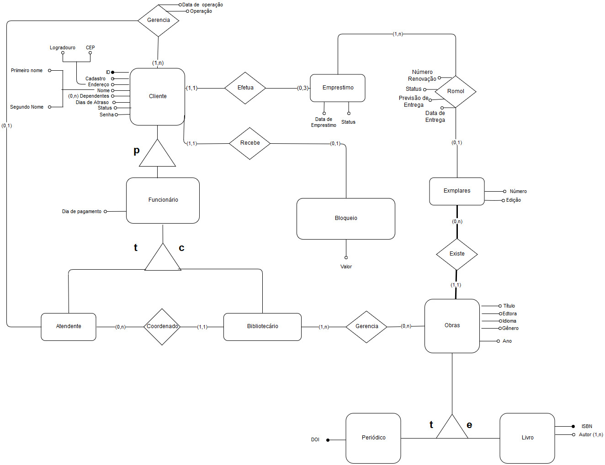

# Projeto final para a matéria Banco de Dados: Sistema Integrado de Biblioteca
Projeto final da disciplina de Banco de Dados, cursada no período 2019.2, com o
profssor Dr. André Britto.

Consiste em um projeto desenvolvido com as bibliotecas ReactJS, no front-end e
NodeJS no back-end, para consulta em um banco de dados MySQL. O diagrama
entidade-relacionamento referente ao Banco de Dados é mostrado abaixo:

Para executar o programa, basta dar os seguintes comandos:

$ npm install

$ npm run dev